# Exercise 1: Exploring the lab environment

## Table of Contents

* [Objective](#objective)
* [Diagram](#diagram)
* [VS Code Guide](#vs-code-guide)
    * [Step 1 - Connecting via VS Code](#step-1---connecting-via-vs-code)
    * [Step 2 - Using the Terminal](#step-2---using-the-terminal)
    * [Step 3 - Connecting to network devices](#step-3---connecting-to-network-devices)
* [Controller Guide ](#automation-controller-guide)
   * [Step 1: Login to Automation controller](#step-1-login-to-automation-controller)
   * [Step 2: Examine the Automation controller Inventory](#step-2-examine-the-automation-controller-inventory)
   * [Step 3: Examine the Automation controller Workshop Project](#step-3-examine-the-automation-controller-workshop-project)
   * [Step 4: Examine the Automation controller Workshop Credential](#step-4-examine-the-automation-controller-workshop-credential)
* [Takeaways](#takeaways)
* [Complete](#complete)

## Objective

Explore and understand the lab environment.  This exercise will cover
* Connecting and working with VS Code
* Determining the Ansible Automation Platform version running on the control node
* Locating and understanding:
  * Automation controller **Inventory**
  * Automation controller **Credentials**
  * Automation controller **Projects**
  * Automation controller **Execution Environment**

## Diagram


## VS Code Guide

### Step 1 - Connecting via VS Code

<table>
<thead>
  <tr>
    <th>It is highly encouraged to use Visual Studio Code to complete the workshop exercises. Visual Studio Code provides:
    <ul>
    <li>A file browser</li>
    <li>A text editor with syntax highlighting</li>
    <li>A in-browser terminal</li>
    </ul>
    Direct SSH access is available as a backup, or if Visual Studio Code is not sufficient to the student.  There is a short YouTube video provided if you need additional clarity: <a href="https://youtu.be/Y_Gx4ZBfcuk">Ansible Workshops - Accessing your workbench environment</a>.
</th>
</tr>
</thead>
</table>

- Connect to Visual Studio Code from the Workshop launch page (provided by your instructor).  The password is provided below the WebUI link.

  

- Type in the provided password to connect.

  

- Open the `network-workshop` directory in Visual Studio Code:

  

- Click on the `playbook.yml` to view the content.

  

### Step 2 - Using the Terminal

- Open a terminal in Visual Studio Code:

  

This is the terminal of the controller server. You can execute commands on the terminal. We will use this in the next step for connecting to the routers.

**[OPTIONAL]**

Navigate to the `network-workshop` directory on the Ansible control node terminal.

```bash
[student1@ansible-1 ~]$ cd ~/network-workshop/
[student1@ansible-1 network-workshop]$ pwd
/home/student1/network-workshop
[student1@ansible-1 network-workshop]$ ls -ltr
```

* `~` - the tilde in this context is a shortcut for the home directory, i.e. `/home/student1`
* `cd` - Linux command to change directory
* `pwd` - Linux command for print working directory.  This will show the full path to the current working directory.
* `ls -ltr` - Linux command to listing files in the the working directory

### Step 3 - Connecting to network devices

There are four routers, named rtr1, rtr2, rtr3 and rtr4.  The network diagram is always available on the [network automation workshop table of contents](../README.md).  The SSH configuration file (`~/.ssh/config`) is already setup on the control node.  This means you can SSH to any router from the control node without a login:

For example to connect to rtr1 from the Ansible control node, type:

```bash
$ ssh rtr1
```

For example:
```
$ ssh rtr1
Warning: Permanently added 'rtr1,35.175.115.246' (RSA) to the list of known hosts.


rtr1#show ver
Cisco IOS XE Software, Version 16.09.02
```


## Automation Controller Guide

### Step 1: Login to Automation controller

1.  Return to the workshop launch page provided by your instructor.

2.  Click on the link to the Automation controller webUI.  You should see a login screen similar to the follow:

   Screenshot of Automation controller login window.
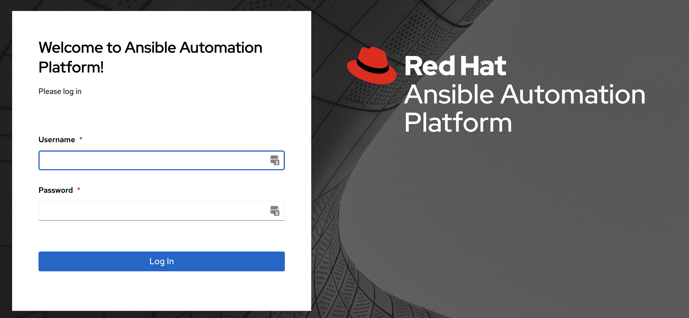

   * The username will be `admin`
   * password provided on launch page


3. After logging in the Job Dashboard will be the default view as shown below.

   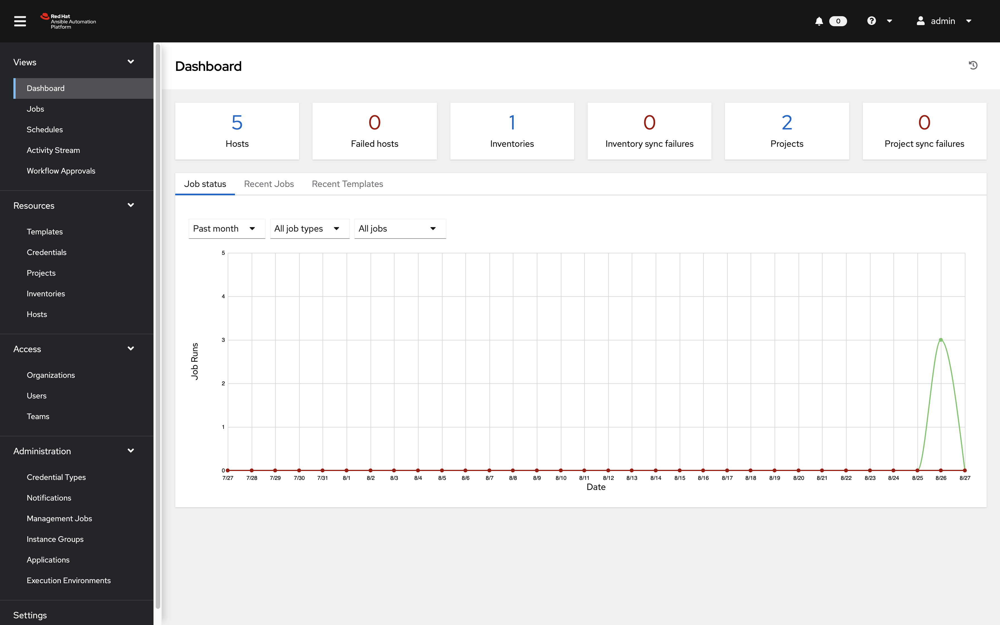

4. Click on the **?** button on the top right of the user interface and click **About**

   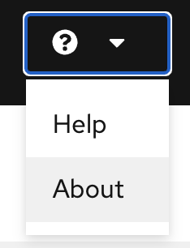

5. A window will pop up similar to the following:

   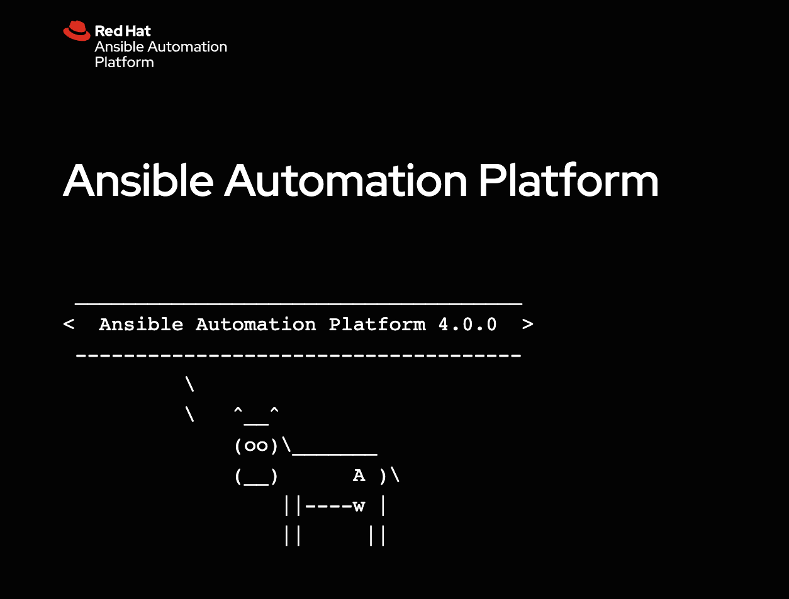


### Step 2: Examine the Automation controller Inventory

An inventory is required for Automation controller to be able to run jobs.  An inventory is a collection of hosts against which jobs may be launched, the same as an Ansible inventory file. In addition, Automation controller can make use of an existing configuration management data base (cmdb) such as ServiceNow or Infoblox DDI.

> Note:
>
> More info on Inventories in respect to Automation controller can be found in the [documentation here](https://docs.ansible.com/automation-controller/4.0.0/html/userguide/inventories.html)

1. Click on the **Inventories** button under **RESOURCES** on the left menu bar.

    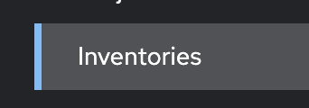

2. Under Inventories click on the `Workshop Inventory`.

    

3. Under the `Workshop Inventory` click the **Hosts** button at the top.  There will be four hosts here, rtr1 through rtr4 as well as the ansible control node.  

   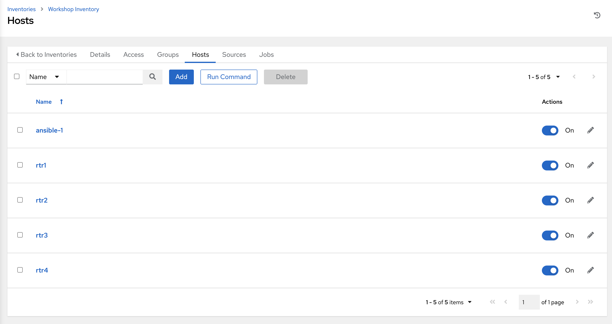

4. Click on one of the devices.

   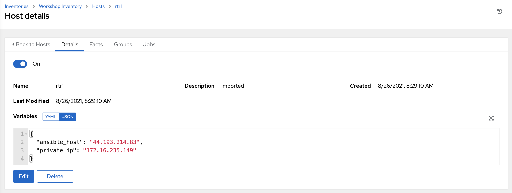

     Take note of the **VARIABLES** field.  The `host_vars` are set here including the `ansible_host` variable.

5. Click on **GROUPS**.  There will be multiple groups here including `routers` and `cisco`.  Click on one of the groups.

   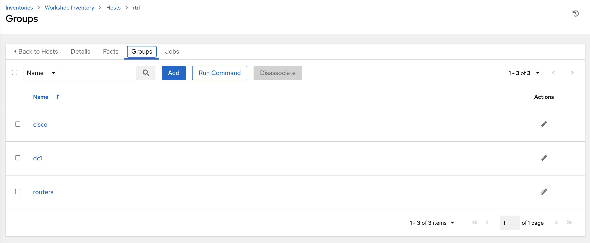

6. Click on one of the groups.

   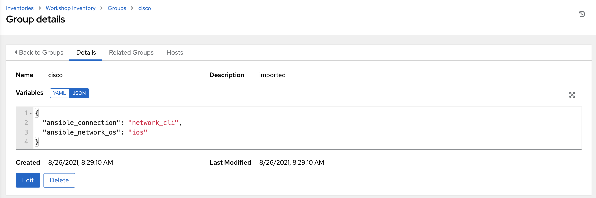

     Take note of the **VARIABLES** field. The `group_vars` are set here including the `ansible_connection` and `ansible_network_os` variable.

### Step 3: Examine the Automation controller Workshop Project

A project is how Ansible Playbooks are imported into Automation controller.  You can manage playbooks and playbook directories by either placing them manually under the Project Base Path on your Automation controller server, or by placing your playbooks into a source code management (SCM) system supported by Automation controller, including Git and Subversion.

> Note:
>
> For more information on Projects in Automation controller, please [refer to the documentation](https://docs.ansible.com/automation-controller/latest/html/userguide/projects.html)

1. Click on the **Projects** button under **RESOURCES** on the left menu bar.

   

2. Under **PROJECTS** there will be a `Workshop Project`.  

    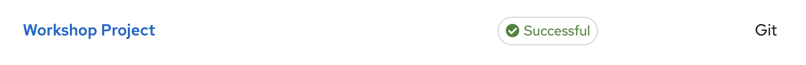

    Note that `GIT` is listed for this project.  This means this project is using Git for SCM.

3. Click on the `Workshop Project`.

  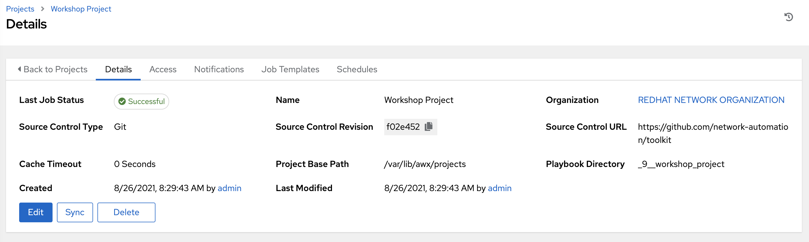

    Note that Source Control URL is set to [https://github.com/network-automation/toolkit](https://github.com/network-automation/toolkit
)

**Student Network Automation Project :**

1. Click on the **Projects** button under **RESOURCES** on the left menu bar.

   

2. Under **PROJECTS** there will be a `Student Network Automation Project`.  

    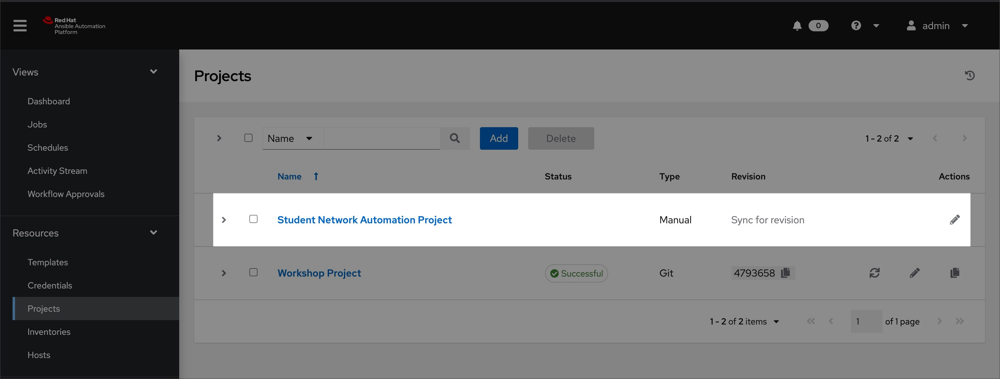

    Note that Type is set to `Manual` for this project.  This means this project is using Manual sync instead of using SCM like GIT.

3. Click on the `Student Network Automation Project`.

  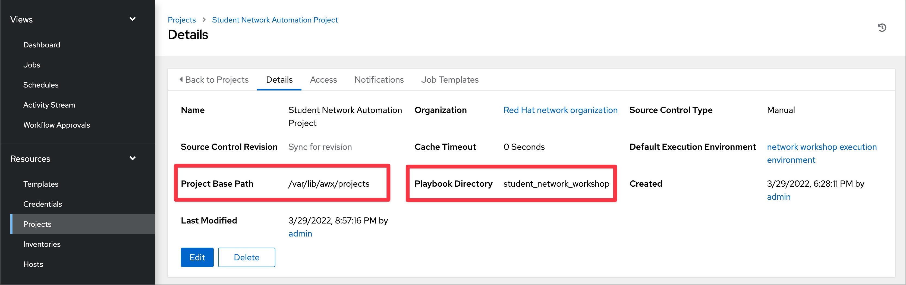

   Note that Playbook Directory is set to `student_network_workshop` and Project Base Path is set to `/var/lib/awx/projects`. This is where you can copy all your playbooks and other artifacts for this project.


### Step 4: Examine the Automation controller Workshop Credential

Credentials are utilized by Automation controller for authentication when launching **Jobs** against machines, synchronizing with inventory sources, and importing project content from a version control system.  For the workshop we need a credential to authenticate to the network devices.

> Note:
>
> For more information on Credentials in Automation controller please [refer to the documentation](https://docs.ansible.com/automation-controller/4.0.0/html/userguide/credentials.html).

1. Click on the **Credentials** button under **Resources** on the left menu bar.

    

2. Under **Credentials** there will be multiple pre-configured credentials, including `Workshop Credential`, `Controller Credential` and the `registry.redhat.io credential`.  Click on the `Workshop Credential`.

    

3. Under the `Workshop Credential` examine the following:

* The **CREDENTIAL TYPE** is a **Machine** credential.
* The **USERNAME** is set to `ec2-user`.
* The **PASSWORD** is blank.
* The **SSH PRIVATE KEY** is already configured, and is **ENCRYPTED**.
  

### Step 5: Examine the Automation controller Execution Environments
Execution Environments are container images that can be utilized as Ansible execution.

We will explore the existing Execution Environment in the workshop environment.

> Note:
>
> Execution Environments are not specifically covered in detail in this workshop because the built-in Ansible Execution Environments already included all the Red Hat supported collections which includes all the network collections we use for this workshop. 
> For more information on Execution Environments please [refer to the documentation](https://docs.ansible.com/automation-controller/latest/html/userguide/execution_environments.html)

1. Click on the **Execution Environments** button under **Administration** on the left menu bar.

    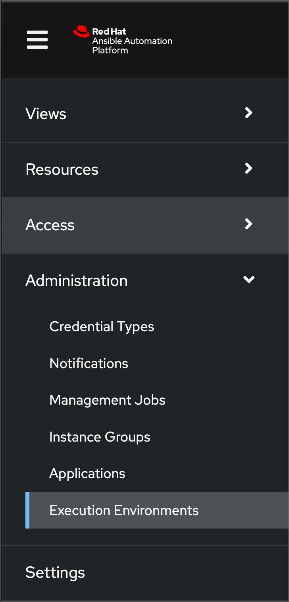

2. Under **Execution Environments** there will be multiple pre-configured execution environments, including `Default execution environment`, `	Minimal execution environment` etc.,. We will be using the `Default execution environment` for our workshop. Please note the link under Image from where the images can be  retrieved (pulled).

    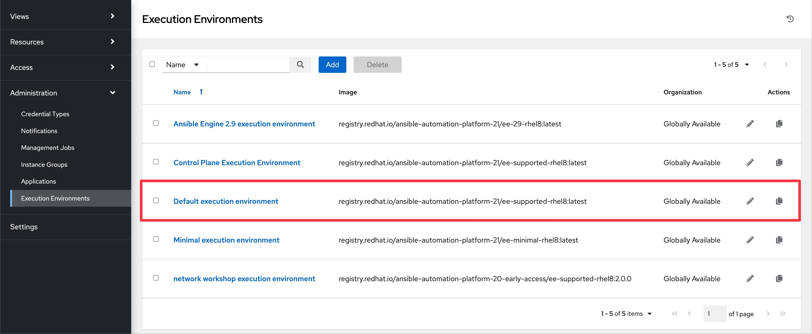


## Takeaways

* Automation controller needs an inventory to execute Ansible Playbooks again.  This inventory is identical to what users would use with the command line only Ansible project.
* Although this workshop already setup the inventory, importing an existing Ansible Automation inventory is easy.  Check out [this blog post](https://www.ansible.com/blog/three-quick-ways-to-move-your-ansible-inventory-into-red-hat-ansible-tower) for more ways to easily get an existing inventory into Automation controller.
* Automation controller can sync to existing SCM (source control management) including Github (Recommended approach) and as well as manual sync. 
* Automation controller can store and encrypt credentials including SSH private keys and plain-text passwords.  Automation controller can also sync to existing credential storage systems such as CyberArk and Vault by HashiCorp

## Complete

You have completed lab exercise 1

You have examined how to access and use VS Code.You have also examined all three components required to get started with Automation controller.  A credential, an inventory and a project.  In the next exercise we will look at job template.

---
[Next Exercise](../2-first-playbook/README-UI.md)

[Click here to return to the Ansible Network Automation Workshop](../README-UI.md)
