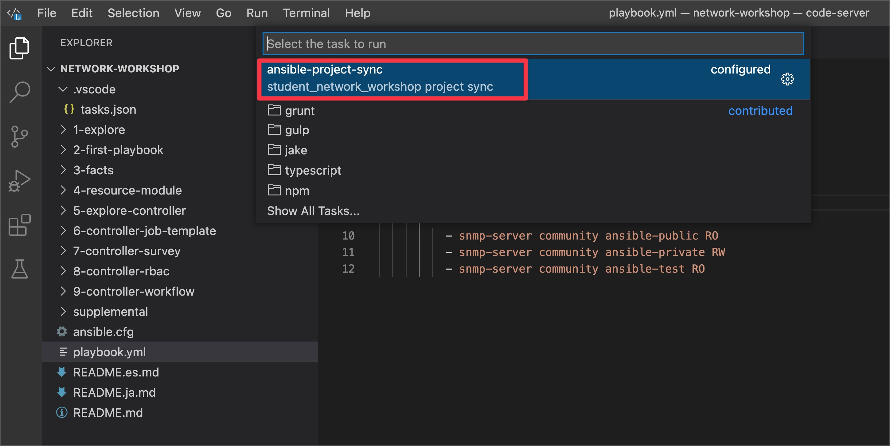

# Exercise 3: Ansible Facts

## Table of Contents

* [Objective](#objective)
* [Guide](#guide)
   * [Step 1 - Using documentation](#step-1---using-documentation)
   * [Step 2 - Creating the play](#step-2---creating-the-play)
   * [Step 3 - Create the facts task](#step-3---create-the-facts-task)
   * [Step 4 - Create Job Template](#step-4---create-job-template)
   * [Step 5 - Launch the Job](#step-5---launch-the-job)
   * [Step 5 - Using debug module](#step-5---using-debug-module)
   * [Step 6 - Re-launch the Job](#step-6---relaunch-the-job)
* [Takeaways](#takeaways)
* [Solution](#solution)
* [Complete](#complete)

## Objective

Demonstration use of Ansible facts on network infrastructure.

Ansible facts are information derived from speaking to the remote network elements.  Ansible facts are returned in structured data (JSON) that makes it easy manipulate or modify.  For example a network engineer could create an audit report very quickly using Ansible facts and templating them into a markdown or HTML file.

This exercise will cover:

* Building an Ansible Playbook from scratch.
* Using the documentation
* Using the [cisco.ios.facts module](https://docs.ansible.com/ansible/latest/collections/cisco/ios/ios_facts_module.html).
* Using the [debug module](https://docs.ansible.com/ansible/latest/modules/debug_module.html).

## Guide

### Step 1 - Using documentation

All Ansible documentation is available at [Ansible docs website](https://docs.ansible.com/). 

List of all the available collections are available at [Ansible docs collections index page](https://docs.ansible.com/ansible/latest/collections/index.html)

Lets look at an example for the the `debug` module in the `ansible.builtin` collection :  [debug module documentaion](https://docs.ansible.com/ansible/latest/collections/ansible/builtin/debug_module.html#ansible-collections-ansible-builtin-debug-module)


Scroll down to the Examples section. Examples can be cut and paste directly from the module documentation into your Ansible Playbook.


When referring to a non-built in module, there is three important fields:

```
namespace.collection.module
```
For example:
```
cisco.ios.facts
```

Explanation of terms:
- **namespace** - example **cisco** - A namespace is grouping of multiple collections.  The **cisco** namespace contains multiple collections including **ios**, **nxos**, and **iosxr**.
- **collection** - example **ios** - A collection is a distribution format for Ansible content that can include playbooks, roles, modules, and plugins.  The **ios** collection contains all the modules for Cisco IOS/IOS-XE
- **module** - example facts - Modules are discrete units of code that can be used in a playbook task. For example the **facts** modules will return structured data about that specified system.

Lets look at an example for the the `cisco.ios.facts` module : [cisco.ios.facts documentaion](https://docs.ansible.com/ansible/latest/collections/cisco/ios/ios_facts_module.html#ansible-collections-cisco-ios-ios-facts-module)


We will be using the facts module in our playbook.

### Step 2 - Creating the play

Ansible Playbooks are [**YAML** files](https://yaml.org/). YAML is a structured encoding format that is also extremely human readable (unlike it's subset - the JSON format)

Create a new file in Visual Studio code:


For simplicity please name the playbook: `facts.yml`:


Enter the following play definition into `facts.yml`:

```yaml
---
- name: gather information from routers
  hosts: cisco
  gather_facts: no
```

Here is an explanation of each line:

* The first line, `---` indicates that this is a YAML file.
* The `- name:` keyword is an optional description for this particular Ansible Playbook.
* The `hosts:` keyword means this playbook against the group `cisco` defined in the inventory file.
* The `gather_facts: no` is required since as of Ansible 2.8 and earlier, this only works on Linux hosts, and not network infrastructure.  We will use a specific module to gather facts for network equipment.

### Step 3 - Create the facts task

Next, add the first `task`. This task will use the `cisco.ios.facts` module to gather facts about each device in the group `cisco`.

```yaml
---
- name: gather information from routers
  hosts: cisco
  gather_facts: no

  tasks:
    - name: gather router facts
      cisco.ios.facts:
```

> Note:
>
> A play is a list of tasks. Modules are pre-written code that perform the task.

Save the playbook.

**Sync the project:**

1. Sync the changes to the controller project. Click on the `Terminal` menu and `Run Task` sub menu.


2. Select the `ansible-project-sync` task from the list shown.This step syncs the playbooks to the controller `Student Network Automation Project` folder. 



> Note:
> This project sync task is NOT required when running in production with project using SCM like github.

### Step 4 - Create Job Template

* Open the web UI and click on the `Templates` link on the left menu.

   

* Click on the blue **Add** button to create a new job template

   

> Note:
>
> Make sure to select `job template` and not `workflow template`)

* Fill out the job template parameters as follows:

  | Parameter | Value |
  |---|---|
  | Name  | Cisco gather facts  |
  |  Job Type |  Run |
  |  Inventory |  Workshop Inventory |
  |  Project |  Student Network Automation Project |
  |  Execution Environment | Default execution environment |
  |  Playbook |  facts.yml |
  |  Credential |  Workshop Credential |
  
  > NOTE: Please use the facts.yml file and NOT the 3-facts/facts.yml

  Screenshot of the job template parameters filled out:
   

* Scroll down and click the blue `Save` button.

### Step 5 - Launch the Job
1. Navigate back to the `Templates` window, where all Job Templates are listed.

2. Launch the `Cisco gather facts` Job Template by clicking the Rocket button.

    

    When the rocket button is clicked this will launch the job.  The job will open in a new window called the **Job Details View**.  More info about [Automation controller jobs](https://docs.ansible.com/automation-controller/latest/html/userguide/jobs.html) can be found in the documentation.
3. Examine the Job run output.


4. Click on the line mentioning `ok: [rtr1]` (line#5) to view the task output in JSON. You can view the facts that were collected from the Cisco network device.


  Scroll down. You will see the facts like serial number , ios version etc., been retrieved. 

  


### Step 5 - Using debug module

Write two additional tasks that display the routers' OS version and serial number.

<!--  -->

``` yaml
---
- name: gather information from routers
  hosts: cisco
  gather_facts: no

  tasks:
    - name: gather router facts
      cisco.ios.facts:

    - name: display version
      debug:
        msg: "The IOS version is: {{ ansible_net_version }}"

    - name: display serial number
      debug:
        msg: "The serial number is:{{ ansible_net_serialnum }}"
```

<!--  -->
> Note: Do not forget to save the yaml file and sync the project. 

### Step 6 - Re-launch the Job

Follow steps 1-3 from `Step 5 - Launch the Job` section to relaunch the job template. 

Examine the output. You can see the output contains our debug messages with the os version and serial number facts.


Using less than 20 lines of "code" you have just automated version and serial number collection. Imagine if you were running this against your production network! You have actionable data in hand that does not go out of date.

## Takeaways

* All ansible documentation is available at [Ansible documentation](https://docs.ansible.com/).
* The [cisco.ios.facts module](https://docs.ansible.com/ansible/latest/collections/cisco/ios/ios_config_module.html) gathers structured data specific for Cisco IOS.  There are relevant modules for each network platform.  For example there is a junos_facts for Juniper Junos, and a eos_facts for Arista EOS.
* The [debug module](https://docs.ansible.com/ansible/latest/modules/debug_module.html) allows an Ansible Playbook to print values to the output window.

## Solution

The finished Ansible Playbook is provided here for an answer key: [facts.yml](facts.yml).

## Complete

You have completed lab exercise 3

---
[Previous Exercise](../2-first-playbook/README-UI.md) | [Next Exercise](../4-resource-module/README-UI.md)

[Click here to return to the Ansible Network Automation Workshop](../README-UI.md)
