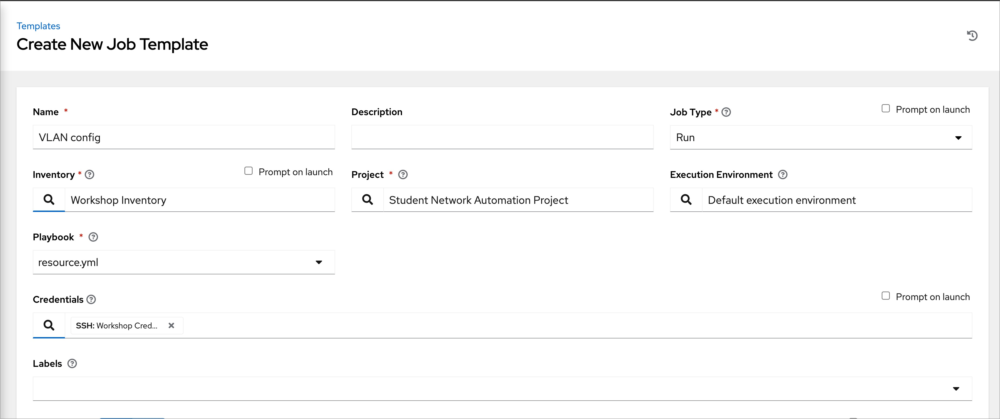
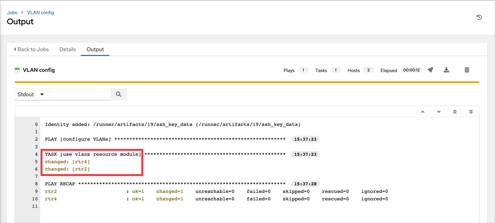
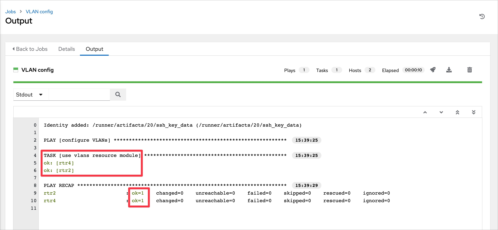
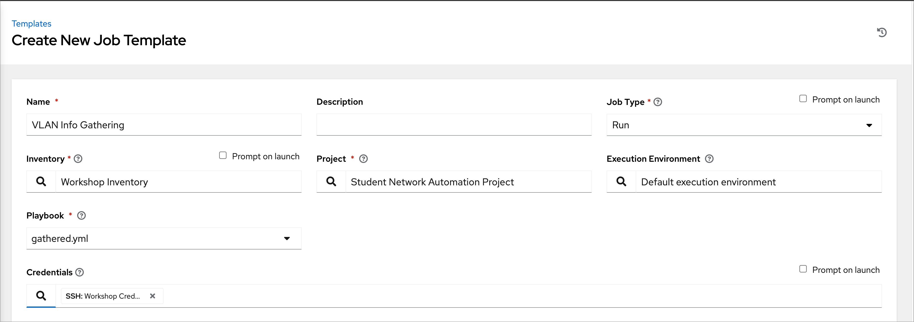
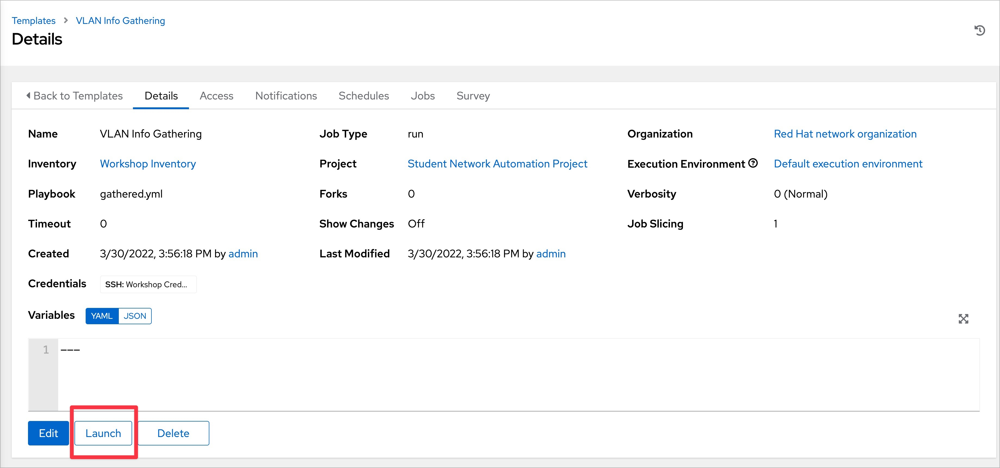
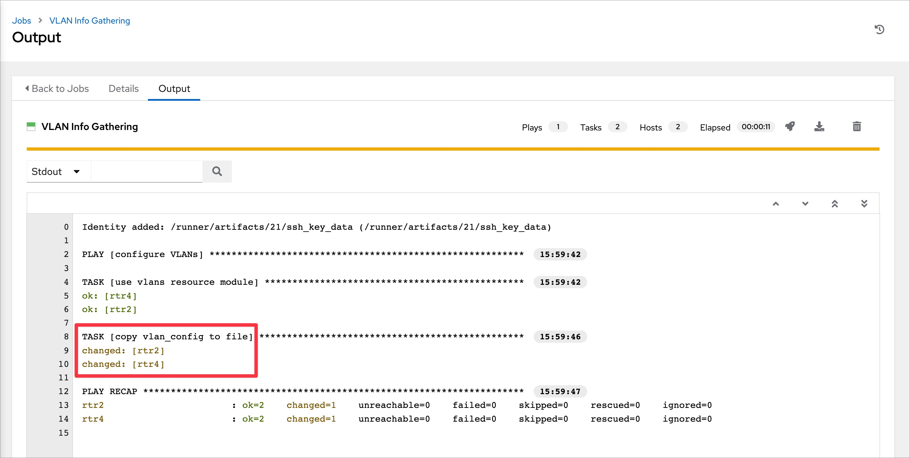

# Exercise 4: Ansible Network Resource Modules

**Read this in other languages**:  [English](README.md),  [日本語](README.ja.md),  [Español](README.es.md).

If you are using an **all Cisco workbench** (all four routers are Cisco IOS routers) please [switch to these directions](../supplemental/4-resource-module-cisco/README.md).

## Table of Contents

  * [Objective](#objective)
  * [Guide](#guide)
    * [Step 1 - Verify VLAN configuration](#step-1---verify-vlan-configuration)
    * [Step 2 - Creating the Ansible Playbook](#step-2---creating-the-ansible-playbook)
    * [Step 3 - Examine the Ansible Playbook and create job template](#step-3---examine-the-ansible-playbook-and-create-job-template)
    * [Step 4 - Launch the Job](#step-4---launch-the-job)
    * [Step 5 - Verify VLAN configuration](#step-5---verify-vlan-configuration)
    * [Step 6 - Using the gathered parameter](#step-6---using-the-gathered-parameter)
    * [Step 7 - Execute the gathered playbook](#step-7---execute-the-gathered-playbook)
    * [Step 8 - Examine the files](#step-8---examine-the-files)
  * [Takeaways](#takeaways)
  * [Solution](#solution)
  * [Complete](#complete)

## Objective

Demonstration use of [Ansible Network Resource Modules](https://docs.ansible.com/ansible/latest/network/user_guide/network_resource_modules.html)

Ansible network resource modules simplify and standardize how you manage different network devices. Network devices separate configuration into sections (such as interfaces and VLANs) that apply to a network service.

Network resource modules provide a consistent experience across different network devices.  This means you will get an identical experience across multiple vendors.  For example the **VLANs** module will work identically for the following modules:

* `arista.eos.vlans`
* `cisco.ios.vlans`
* `cisco.nxos.vlans`
* `cisco.iosxr.vlans`
* `junipernetworks.junos.vlans`

Configuring [VLANs](https://en.wikipedia.org/wiki/Virtual_LAN) on network devices is an extremely common task, and mis-configurations can cause headaches and outages.  VLAN configurations also tend to be identical across multiple network switches resulting in a perfect use case for automation.

This exercise will cover:

* Configuring VLANs on Arista EOS
* Building an Ansible Playbook using the [arista.eos.vlans module](https://docs.ansible.com/ansible/latest/collections/arista/eos/eos_vlans_module.html).
* Understanding the `state: merged`
* Understanding the `state: gathered`

## Guide

### Step 1 - Verify VLAN configuration

* Login to an Arista switch and verify the current VLAN configuration.

* From the control node terminal, you can `ssh rtr2` and type `enable`

  ```bash
  $ ssh rtr2
  Last login: Wed Sep  1 13:44:55 2021 from 44.192.105.112
  rtr2>enable
  ```

* Use the command `show vlan` to examine the VLAN configuration:

  ```bash
  rtr2#show vlan
  VLAN  Name                             Status    Ports
  ----- -------------------------------- --------- -------------------------------
  1     default                          active   
  ```

* Use the `show run | s vlan` to examine the VLAN running-confgiuration on the Arista device:

  ```bash
  rtr2#show run | s vlan
  rtr2#
  ```

As you can see in the output above there is no VLAN configuration outside of the default VLAN 1 (which is not assigned any ports).

### Step 2 - Creating the Ansible Playbook

*  Create a new file in Visual Studio Code named `resource.yml`

   

* Copy the following Ansible Playbook into your `resource.yml`

   ```yaml
  ---
  - name: configure VLANs
    hosts: arista
    gather_facts: false

    tasks:

    - name: use vlans resource module
      arista.eos.vlans:
        state: merged
        config:
          - name: desktops
            vlan_id: 20
          - name: servers
            vlan_id: 30
          - name: printers
            vlan_id: 40
          - name: DMZ
            vlan_id: 50
   ```

* Setup will look similar to the following in Visual Studio Code:

   

* Save the yaml file and sync the project using the vs code menu `Terminal → Run Task → ansible-project-sync`

### Step 3 - Examine the Ansible Playbook and create job template

* First lets examine the first four lines:

  ```yaml
  ---
  - name: configure VLANs
    hosts: arista
    gather_facts: false
  ```

  * The `---` designates this is a [YAML](https://en.wikipedia.org/wiki/YAML) file which is what we write playbooks in.
  * `name` is the description of what this playbook does.
  * `hosts: arista` will execute this playbook only on the Arista network devices.
  * `gather_facts: false` this will disable fact gathering for this play, by default this is turned on.


* For the second part we have one task that uses the `arista.eos.vlans`

  ```yaml
    tasks:

    - name: use vlans resource module
      arista.eos.vlans:
        state: merged
        config:
          - name: desktops
            vlan_id: 20
          - name: servers
            vlan_id: 30
          - name: printers
            vlan_id: 40
          - name: DMZ
            vlan_id: 50
  ```

  * `name:` - just like the play, each task has a description for that particular task
  * `state: merged` - This is the default behavior of resource modules.  This will simply enforce that the supplied configuration exists on the network device.  There is actually seven parameters possible for resource modules:
    * merged
    * replaced
    * overridden
    * deleted
    * rendered
    * gathered
    * parsed

    Only two of these parameters will be covered in this exercise, but additional are available in the [supplemental exercises](../supplemental/README.md).
  * `config:` - this is the supplied VLAN configuration.  It is a list of dictionaries. The most important takeaway is that if the module was change from `arista.eos.vlans` to `junipernetworks.junos.vlans` it would work identically.  This allows network engineers to focus on the network (e.g. VLAN configuration) versus the vendor syntax and implementation.

#### Create the Job Template


* Open the web UI and click on the `Templates` link on the left menu.

   

* Click on the blue **Add** button to create a new job template

   

> Note:
>
> Make sure to select `job template` and not `workflow template`)

* Fill out the job template parameters as follows:

  | Parameter | Value |
  |---|---|
  | Name  | VLAN Config   |
  |  Job Type |  Run |
  |  Inventory |  Workshop Inventory |
  |  Project |  Student Network Automation Project |
  |  Execution Environment | Default execution environment |
  |  Playbook |  resource.yml |
  |  Credential |  Workshop Credential |
  
  > NOTE: Please use the resource.yml file and NOT the 4-resource-module/resource.yml

  Screenshot of the job template parameters filled out:
  

* Scroll down and click the blue `Save` button.

### Step 4 - Launch the Job

1. Navigate back to the `Templates` window, where all Job Templates are listed.

2. Launch the `VLAN config` Job Template by clicking the Rocket button.

    

    When the rocket button is clicked this will launch the job.  The job will open in a new window called the **Job Details View**.  More info about [Automation controller jobs](https://docs.ansible.com/automation-controller/latest/html/userguide/jobs.html) can be found in the documentation.
3. Examine the Job run output.





* Re-running the job will demonstrate the concept of [idempotency](https://en.wikipedia.org/wiki/Idempotence)



* As you can see in the output, everything will return `ok=1` indiciating that no changes were taken place.

### Step 5 - Verify VLAN configuration

* Login to an Arista switch and verify the current VLAN configuration.

* From the control node terminal, you can `ssh rtr2` and type `enable`

  ```bash
  $ ssh rtr2
  Last login: Wed Sep  1 13:44:55 2021 from 44.192.105.112
  rtr2>enable
  ```

* Use the command `show vlan` to examine the VLAN configuration:

  ```bash
  rtr2#show vlan
  VLAN  Name                             Status    Ports
  ----- -------------------------------- --------- -------------------------------
  1     default                          active   
  20    desktops                         active   
  30    servers                          active   
  40    printers                         active   
  50    DMZ                              active  
  ```

* Use the `show run | s vlan` to examine the VLAN running-confgiuration on the Arista device:

  ```bash
  rtr2#sh run | s vlan
  vlan 20
     name desktops
  !
  vlan 30
     name servers
  !
  vlan 40
     name printers
  !
  vlan 50
     name DMZ
  ```

As you can see, the resource module configured the Arista EOS network device with the supplied configuration.  There are now five total VLANs (including the default vLAN 1).

### Step 6 - Using the gathered parameter

* Create a new playbook named `gathered.yml`

<!--  -->

  ```yaml
  ---
  - name: configure VLANs
    hosts: arista
    gather_facts: false

    tasks:

    - name: use vlans resource module
      arista.eos.vlans:
        state: gathered
      register: vlan_config

    - name: copy vlan_config to file
      copy:
        content: "{{ vlan_config | to_nice_yaml }}"
        dest: "/opt/ansible/{{ inventory_hostname }}_vlan.yml"
  ```
  <!--  -->

* Save the yaml file and sync the project using the vs code menu `Terminal → Run Task → ansible-project-sync`

* The first task is identical except the `state: merged` has been switched to `gathered`, the `config` is no longer needed since we are reading in the configuration (verus applying it to the network device), and we are using the `register` to save the output from the module into a variable named `vlan_config`

* The second task is copying the `vlan_config` variable to a flat-file.  The double currly brackets denotes that this is a variable.  

*  The `| to_nice_yaml` is a [filter](https://docs.ansible.com/ansible/latest/user_guide/playbooks_filters.html), that will transform the JSON output (default) to YAML.

* The  `inventory_hostname` are special varaible also referred to as [magic variables](https://docs.ansible.com/ansible/latest/reference_appendices/special_variables.html).  The `inventory_hostname` is the name of the device in our inventory.  This means the file will be saved as `/opt/ansible/rtr2_vlan.yml` and `/opt/ansible/rtr4_vlan.yml` for the two arista devices.

### Step 7 - Execute the gathered playbook

#### Create the Job Template

* Open the web UI and click on the `Templates` link on the left menu.

   

* Click on the blue **Add** button to create a new job template

   

> Note:
>
> Make sure to select `job template` and not `workflow template`)

* Fill out the job template parameters as follows:

  | Parameter | Value |
  |---|---|
  | Name  | VLAN Info Gathering   |
  |  Job Type |  Run |
  |  Inventory |  Workshop Inventory |
  |  Project |  Student Network Automation Project |
  |  Execution Environment | Default execution environment |
  |  Playbook |  gathered.yml |
  |  Credential |  Workshop Credential |
  
  > NOTE: Please use the gathered.yml file and NOT the 4-resource-module/gathered.yml

  Screenshot of the job template parameters filled out:
  

* Scroll down and click the blue `Save` button.

#### Launch the Job

* Click on the Launch button on the Job templates details view from last step.
  

* Examine the output. 


### Step 8 - Examine the files

* Open the newly created files that `gathered` the VLAN confgiuration from the Arista network devices.

* The two files were saved to `/opt/ansible/rtr2_vlan.yml/rtr2_vlan.yml` and `/opt/ansible/rtr2_vlan.yml/rtr4_vlan.yml` for the two arista devices.

* Here is a screenshot:

  

## Takeaways

* Resource modules have a simple data structure that can be transformed to the network device syntax.  In this case the VLAN dictionary is transformed into the Arista EOS network device syntax.
* Resource modules are Idempotent, and can be configured to check device state.
* Resource Modules are bi-directional, meaning that they can gather facts for that specific resource, as well as apply configuration.  Even if you are not using resource modules to configure network devices, there is a lot of value for checking resource states.  
* The bi-directional behavior also allows brown-field networks (existing networks) to quickly turn their running-configuration into structured data.  This allows network engineers to get automation up running more quickly and get quick automation victories.

## Solution

The finished Ansible Playbook is provided here for an answer key:

-  [resource.yml](resource.yml)
-  [gathered-ui.yml](gathered-ui.yml)

## Complete

You have completed lab exercise 4

As stated previously only two of the resource modules parameters were covered in this exercise, but additional are available in the [supplemental exercises](../supplemental/README.md).

In the next exercise we will start using Automation controller.
---
[Previous Exercise](../3-facts/README-UI.md) | [Next Exercise](../5-explore-controller/README-UI.md)

[Click here to return to the Ansible Network Automation Workshop](../README-UI.md)
